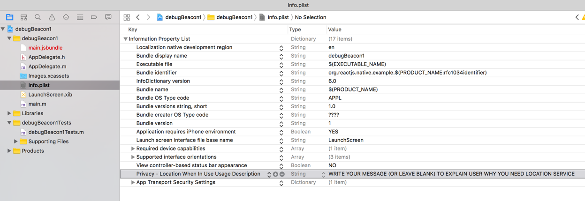

# Fully detailed documentation for "ranging beacons in iOS"

This documentation give a deeper explanation on how to range (*but ranging only*) beacons in iOS.

This documentation is linked to the sample code [ranging.ios.js](./ranging.ios.js)

## 1- request authorization

When dealing with Beacons, you technically deal with native location ([see Apple documentation](https://developer.apple.com/reference/corelocation/cllocationmanager)).

Before starting ranging, iOS force you to ask for authorization in case of location services.

If you don't:
- it won't generate an error
- but nothing will happen until you have authorization


You can request 2 kind of authorizations depending on the use case:
> Do you need background capability or not?

[See matching lines in sample example](https://github.com/MacKentoch/react-native-beacons-manager/blob/master/examples/samples/ranging.ios.js#L35)

### 1.a `Beacons.requestWhenInUseAuthorization();` (**foreground** only use-case)

#### in your react native application
Ensure to call

```javascript
Beacons.requestWhenInUseAuthorization();
```

#### in your iOS project

To be effective your `info.plist` file should have `Privacy - Location When In Use Usage Description` key defined (*empty value or not. It is better to define a value to a custom / more user-friendly message*).

By chance `react-native init YOUR_APP_NAME` should have already set it for you in your `info.plist` file.

*Just check it:*




### 1.b `Beacons.requestAlwaysAuthorization();` (**background use-case**)

#### in your react native application
Ensure to call

```javascript
Beacons.requestAlwaysAuthorization();
```

#### in your iOS project

To be effective your `info.plist` file should have `Privacy - Location Always Usage Description` key defined (*empty value or not. It is better to define a value to a custom / more user-friendly message*).

*You have to manually `add it` to your `info.plist`:*


## 2- start ranging

Tell iOS what you want to range by defining a desired `region` object.


```javascript
// Define a region which can be identifier + uuid,
// identifier + uuid + major or identifier + uuid + major + minor
// (minor and major properties are numbers)
const region = { identifier, uuid };

// Range for beacons inside the region
Beacons.startRangingBeaconsInRegion(region);
```

[See matching lines in sample example](https://github.com/MacKentoch/react-native-beacons-manager/blob/master/examples/samples/ranging.ios.js#L40)

## 3- register events

Ranging now works.

You have to register events to know and use about data from location updates.

```javascript

// Ranging: Listen for beacon changes
DeviceEventEmitter.addListener(
  'beaconsDidRange',
  ({region: {identifier, uuid}, beacons) => {
    // do here anything you need (ex: setting state...)
    console.log('beaconsDidRange these beacons: ', beacons);
  }
);
```

Note: beacons is an array of object:
```javascript

{
  uuid,
  major,
  minor,
  rssi,
  proximity,
  accuracy,
}
```

[See matching lines in sample example](https://github.com/MacKentoch/react-native-beacons-manager/blob/master/examples/samples/ranging.ios.js#L55)


## 4- on componentWillUnMount: unregister events and stop ranging

A good practise is to ALWAYS unregister events in `componentWillUnMount`.

Tell iOS to stop ranging at the same time.

```javascript
// stop ranging beacons:
Beacons.stopRangingBeaconsInRegion();
// remove all listeners in a row
DeviceEventEmitter.remove();
```

[See matching lines in sample example](https://github.com/MacKentoch/react-native-beacons-manager/blob/master/examples/samples/ranging.ios.js#L64)
